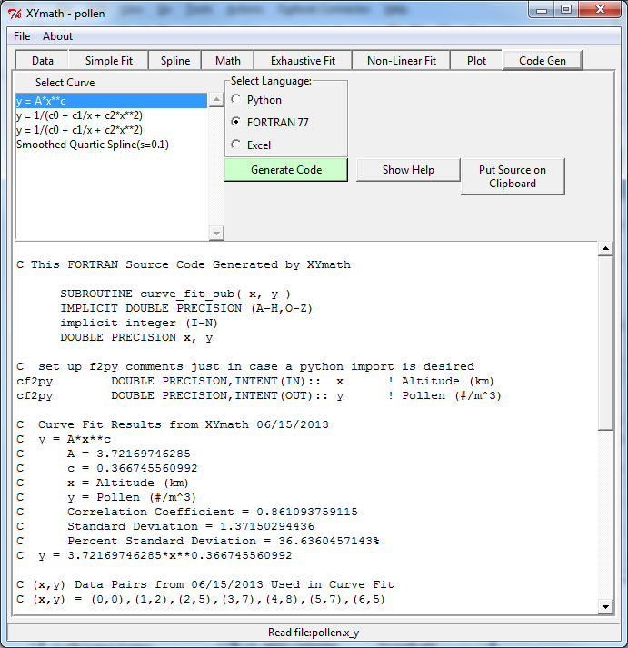

.. code_gen

Code Generation
===============

To Generate Code for the curve fit:
        
1) Select the desired curve
2) Select the desired language
3) Press "Generate Code" button

The text box will be filled with the desired code which can then be copied and pasted into any text editor. (Using ``Put Source on Clipboard`` button)

When copy to clipboard button appears, click it to place the source code on the computers clipboard for pasting into a text editor.

All too often, the results of a curve fit are buried deep in an application's source code without sufficient documentation to recreate, verify or update the equation. The source code generated by XYmath will answer those needs.

Another often neglected aspect of using curve fits is enforcing the fit's range of applicability. The source code generated by XYmath will print warnings if the curve fit is called with an x value outside of the x data range.

Python
------

The generated python code is currently python 2.x (i.e. old style `print` statement)

.. todo::
    Add option for python 3.x code generation

FORTRAN
-------

Compiled FORTRAN can be imported into python through the use of the f2py utility that comes with numpy. The XYmath-generated FORTRAN code contains comments("cf2py") that help with the use of the f2py.

For example: 
python.exe -c "from numpy.f2py import main; main()" cfit.f -m cfit -h cfit.pyf
will create an f2py definition file called "cfit.pyf" from a FORTRAN source file called "cfit.f".

python.exe -c "from numpy.f2py import main; main()" cfit.pyf cfit.f 
will create a file called "cfit.pyd" that python can import with "import cfit"

See the f2py documentation for generating pyf and pyd files. Your machine may need special options such as "-c --compiler=mingw32" and/or "--fcompiler=gnu95" to define your FORTRAN compiler.

Excel
-----

If Excel is selected, Excel will be launched and populated with the curve data. **(On Windows Only)**

Example
-------

Below is an example of a FORTRAN routine generated by XYmath::

    C This FORTRAN Source Code Generated by XYmath
    
          SUBROUTINE curve_fit_sub( x, y )
          IMPLICIT DOUBLE PRECISION (A-H,O-Z)
          implicit integer (I-N)
          DOUBLE PRECISION x, y
          
    C  set up f2py comments just in case a python import is desired
    cf2py        DOUBLE PRECISION,INTENT(IN)::  x      ! Altitude (km)
    cf2py        DOUBLE PRECISION,INTENT(OUT):: y      ! Pollen (#/m^3)
    
    C  Curve Fit Results from XYmath 06/15/2013
    C  y = A*x**c
    C      A = 3.72169746285
    C      c = 0.366745560992
    C      x = Altitude (km)
    C      y = Pollen (#/m^3)
    C      Correlation Coefficient = 0.861093759115
    C      Standard Deviation = 1.37150294436
    C      Percent Standard Deviation = 36.6360457143%
    C  y = 3.72169746285*x**0.366745560992    
    
    C (x,y) Data Pairs from 06/15/2013 Used in Curve Fit 
    C (x,y) = (0,0),(1,2),(2,5),(3,7),(4,8),(5,7),(6,5)
    
    
    C  If input value of x is out of range, print warning
          IF (x.lt.0.0D0 .or. x.gt.6.0D0)THEN
            print*, 'WARNING... x is outside range in curve_fit_sub'
            print*, '  x =',x,' x range = (0.0D0 to 6.0D0)'
          ENDIF
        
          y = 3.72169746285D0*x**0.366745560992D0
    
          RETURN
          END
          PROGRAM TEST
          IMPLICIT DOUBLE PRECISION (A-H,O-Z)
          implicit integer (I-N)
    
          print*, '============================'
          call curve_fit_sub( 6.0D0, y_test )
          print*, 'y_test  =',y_test,'for x_test =',6.0D0
          print*, 'y_xymath=',7.1800022981D0
          print*, ' '
          print*, 'y_test should equal y_xymath above.'
          STOP
          END      
    
