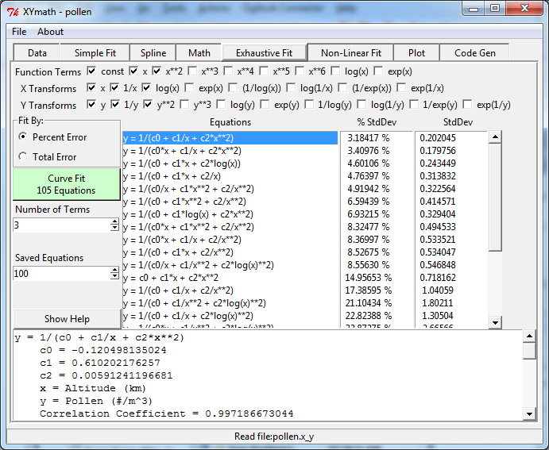

.. curve_fit

Curve Fitting
=============

XYmath will find the "best" curve fit using either minimum percent error or minimum total error. 

It's fitting options are:

    #. Simple Fit
        - common equations
    #. Exhaustive Fit
        - an exhaustive search through thousands of equations
    #. Spline
        - exact or smoothed
    #. Non-Linear Fit
        - non-linear equations input by the user

Simple Fit
----------

The X,Y data can be fitted to equations by minimizing either total error, or percent error. Selecting the "Total Error" or "Percent Error" radio button at upper left will determine which approach is used.

A limited set of common equations with 1 to 4 terms on the right hand side is fit to the data when the "Curve Fit" button is pressed.

If fewer than 4 terms are desired, the "Max Terms" can be reduced from 4  to the desired number.

All of the equations are listed in order from best to worst standard deviation or percent standard deviation as appropriate.

Note that for some equations, divide by zero is allowed if it results in (1/infinity) which is equal to 0.0

The equations in "Simple Fit" are::

    y = c0 + c1*x + c2*x**2 + c3*x**3 <-- CUBIC POLYNOMIAL
    y = c0 + c1/x + c2*x + c3*x**2
    y = c0 + c1/x + c2/x**2 + c3*x
    y = c0 + c1/x + c2/x**2 + c3/x**3
    y = c0 + c1*x + c2*x**2   <-- QUADRATIC POLYNOMIAL
    y = c0 + c1*x + c2/x
    y = c0 + c1/x + c2/x**2
    y = 1/(c0 + c1/x + c2*x)
    y = exp(c0 + c1*x + c2*log(x))
    y = c0 + c1*x          <-- STRAIGHT LINE
    y = c0 + c1/x
    y = c0*x + c1*x**2     <-- QUADRATIC THROUGH ORIGIN
    y = c0 + c1*log(x)
    y = 1/(c0 + c1*x)      <-- STRAIGHT LINE FOR 1/y
    y = 1/(c0 + c1/x)
    y = 1/(c0 + c1*log(x))
    y = 1/(c0*x + c1/x)
    y = exp(c0 + c1*log(x))  <-- LINEARIZED EXPONENTIAL y=A*x**n
    y = exp(c0 + c1/x)
    y = exp(c0 + c1*x)
    y = c0*x           <-- STRAIGHT LINE THROUGH ORIGIN
    y = c0/x
    y = c0   <-- MEAN OR WEIGHTED MEAN 

Notice on the plot below that two different equations were selected and plotted.

   

Splines
-------

Spline curves can go through all data points or be smoothed to give an approximation of the data. To create spline curve fit:
        
1) Select the desired spline, or splines (order 1 to 5, Linear to Quintic)
2) Select any desired "smoothing"

If smoothing is equal to zero, the spline will go through all data points.

With smoothing added, the curve will go near the data points, but not necessarily through them. Click the Smoothing spin box to change the amount of smoothing.

Standard deviation and percent standard deviation will be calculated for smoothed splines along with their correlation coefficient.

Note that multiple splines can be fitted to the data simply by selecting more than one spline in the listbox.

The graph below shows a spline that goes through every data point.

   

Exhaustive Fit
--------------

As in "Simple Fit", the X,Y data can be fitted to equations by minimizing either total error, or percent error. Selecting the "Total Error" or "Percent Error" radio button will determine which approach is used.

Equations are generated by using all linear combinations of terms and transforms selected. Each equation has the number of terms selected.

Selecting function terms of "const", "x" and "x\*\*2" results in all combinations of those terms on the right hand side of the equations. Each of those x terms can be modified by x transforms.

Selecting x transforms of "x", "1/x" and "log(x)" results in all terms using x being transformed into "x", "1/x" or "log(x)". For example "x\*\*2" would become "x\*\*2", "1/x\*\*2" or "log(x)\*\*2".

Selecting y transforms of "y", "1/y" and "y**2" results in y=f(x), 1/y=f(x) and y\*\*2=f(x) all being examined.

All of the equations are listed in order from best to worst standard deviation or percent standard deviation as appropriate.

By default, only the top 100 equations are listed, however, that can be changed with the "Saved Equations" selection box.

Note that for some equations, divide by zero is allowed if it results in (1/infinity) which is equal to 0.0

    

Non-Linear Fit
--------------

Any equation of the form y=f(x) may be entered and fit to the data here.

**Enter ONLY the Right Hand Side of Your Equation**
(Assumed to be "y" equals a function of "x".  or "y=f(x)")

For example to fit the equation: **y = A\*x\*\*c** simply enter: **A\*x\*\*c**

Notice that "x" must be lower case. Constants can be any mix of upper or lower case. 

Standard variable name rules apply. For example legal names include 
   A, c, mu, c8, theta, myConst, ZZZ, C3H8

**Do NOT include "y" in the equation's right hand side.**

All constants start out with a value of 1.0 and are then optimized with a least squares approach to find the best values. Sometimes the optimization process will get stuck in a local optima. If this appears to be the case, edit the constant's values and click "Set Constants", followed by "Improve Fit". If the equation form is a good one, this can result in a better curve fit.

Standard functions sin, cos, tan, log, log10, exp, sqrt, log1p, sinh, cosh and tanh are available.

Be aware that linear equations will also work correctly. for example enter "m\*x + b" to fit a straight line.

As in "Simple Fit" and "Exhaustive Fit", be sure to select either Percent or Total Error.

Note that for some equations, divide by zero is allowed if it results in (1/infinity) which is equal to 0.0

.. image:: ./_static/nonlinear_page.png
    :width: 70%    
        