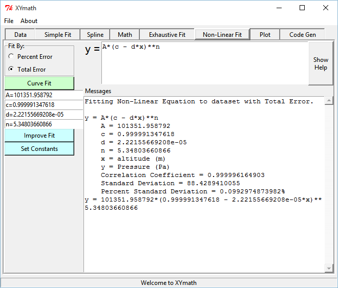
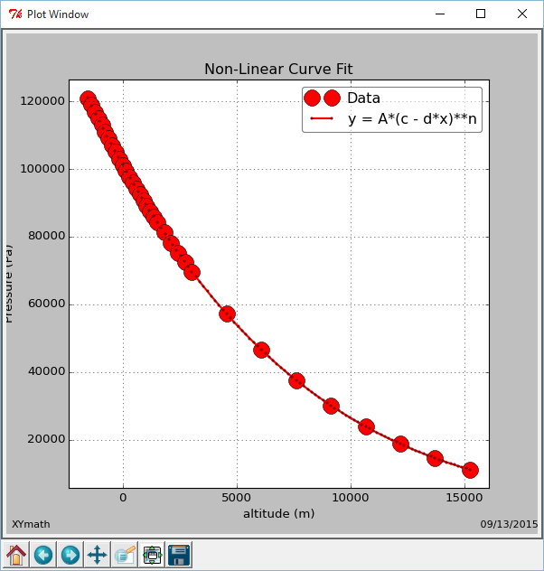
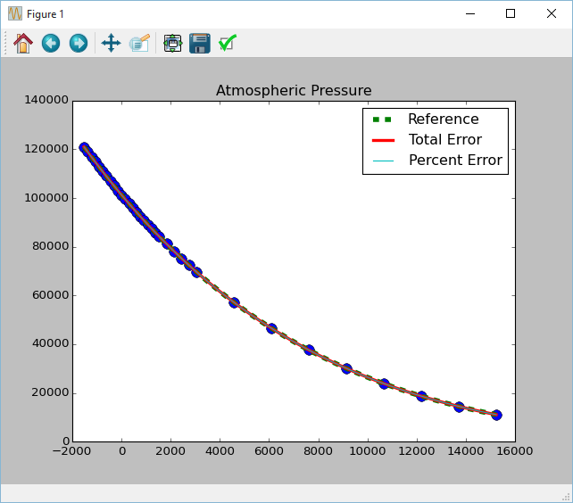
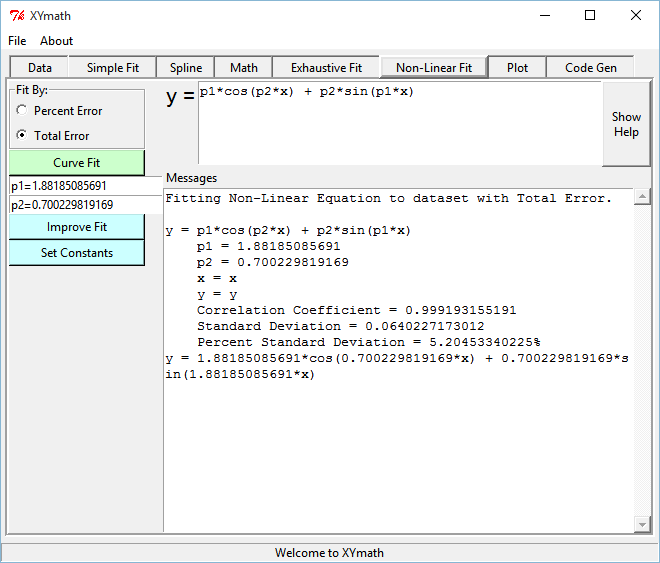
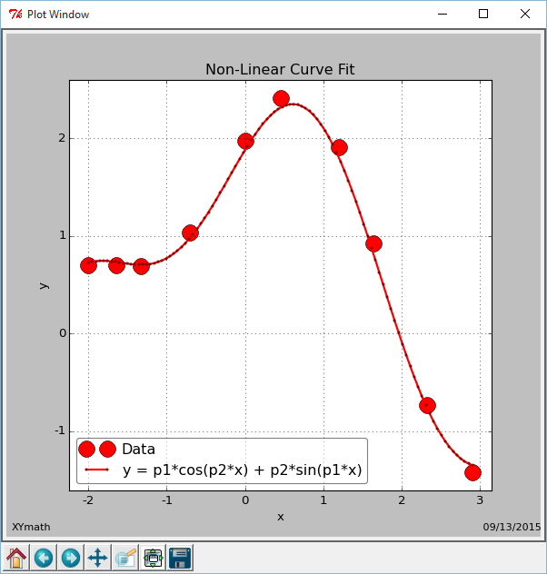
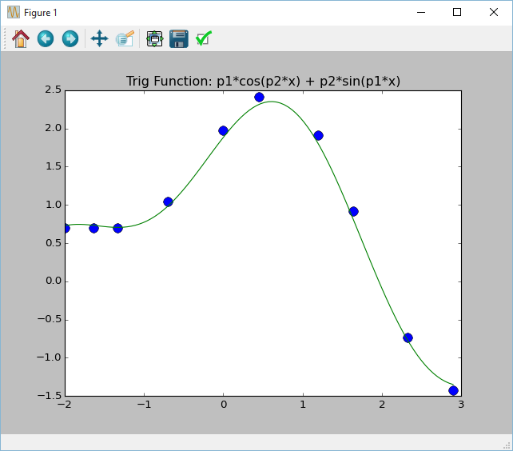

.. examples

.. _internal_examples:

Example Scripts
===============

There are several ways to run XYmath
    
    1. Launch the GUI, enter and fit data and perhaps run some math operations 
        - (see :ref:`internal_launch_gui` and :ref:`internal_entering_data` and :ref:`internal_math_ops`)
    2. Write a script to launch the GUI with data
    3. Run a script that outputs to the console
    
The examples that follow will show both GUI and console scripts (options 2 & 3 above).

.. warning::
    It is dangerous to run a console curve fit and accept it without looking at a plot.

    Curve fitting is mostly about what happens **Between** the points, not **At** the points.

.. _internal_example_inst_cal:

Instrument Calibration
----------------------

This example comes from: http://terpconnect.umd.edu/~toh/spectrum/CurveFitting.html

The author shows a linear fit of an instrument reading chemical concentrations

The author mentions that a quadratic fit w/o the data point at 
concentration=0.6 would be significantly better... that is also calculated.

With GUI
~~~~~~~~

The script ``/xymath/examples/calibration_gui.py`` launches the XYmath GUI with the calibration data so that the GUI can perform the desired calculations.

.. code:: python

    from numpy import array
    from xymath.dataset import DataSet
    from xymath.linfit import LinCurveFit
    from xymath.xy_job import XY_Job
    from xymath.gui.xygui import main as run_gui

    concL = [0.1,0.2,0.3,0.4,0.5,0.6,0.7,0.8,0.9,1]
    readingL = [1.54,2.03,3.17,3.67,4.89,6.73,6.74,7.87,8.86,10.35]
    DS = DataSet(concL, readingL, xName='Concentration', yName='Instrument Reading')

    XY = XY_Job()
    XY.define_dataset(concL, readingL, wtArr=None, xName='Concentration', 
                      yName='Instrument Reading', xUnits='', yUnits='')
    run_gui( XY )

Once launched, the following steps can be taken inside the GUI::

        1) Launch XYmath with code above
        2) Go to "Simple Fit" Tab 
        3) Hit "Curve Fit"
            - XYmath will show "c0 + c1/x + c2/x**2 + c3*x" as best fit
        4) Select "y = c0 + c1*x" to approximate the author's results
        5) Go to "Data" Tab
        6) Select "weight" of data point with concentration=0.6
            - Set that weight to 0.0
        7) Go back to "Simple Fit" Tab and hit "Curve Fit"
            - Notice that the zero-weighted point is marked as such on the plot
            - As the author predicts, the fit is greatly improved
            - Surprisingly, XYmath shows the 3 term equation "y = c0 + c1*x + c2/x"
              to be superior to the 4 term equations as well as the quadratic.

Running the above code, launches the GUI, preloaded with the concentration data. 

**Using "Simple Fit" results in the GUI and plot shown below.**

.. image:: ./_static/ex_conc_simple_fit_gui.png
    :width: 52%
.. image:: ./_static/ex_conc_simple_fit_plot.png
    :width: 40%
   

**Selecting the straight line "y = c0 + c1*x" gives the GUI and plot shown below.**

.. image:: ./_static/ex_conc_simple_fit_gui_v2.png
    :width: 52%
.. image:: ./_static/ex_conc_simple_fit_plot_v2.png
    :width: 40%

**Use "Data" tab to set weight of data point at concentration=.6 to zero.**

.. image:: ./_static/ex_conc_simple_fit_gui_zerowt.png
    :width: 52%

**Rerun "Simple Fit" and select author's quadratic recommendation**

Notice that the data point at concentration=0.6 is still on the plot, but it is labeled as "Weighted Low" and its weight value is indicated as "x0".

.. image:: ./_static/ex_conc_simple_fit_gui_zerowt_quad.png
    :width: 52%
.. image:: ./_static/ex_conc_simple_fit_gui_zerowt_quad_plot.png
    :width: 40%

With Console
~~~~~~~~~~~~

As you might imagine, the console script is longer because it performs many of the steps done manually in the GUI example.  

This example first duplicates the author's equation (i.e. sets the straight line coefficients to the same values as the author (``cArrInp=[0.199, 9.7926]``) and calculates standard deviation and percent standard deviation as a reference.

Then runs XYmath to fit the points. It results in only a very slight improvment in the author's answer (see output below python script).

And finally removes the point at concentration=0.6 and fits to a quadratic. This results in the big improvement that the author was looking for (see output below python script).

Here's the code from ``/xymath/examples/calibration.py``.

.. code:: python

    try:
        from matplotlib import pyplot as plt
        got_plt = True
    except:
        got_plt = False
        
    from xymath.dataset import DataSet
    from xymath.linfit import LinCurveFit

    concL = [0.1,0.2,0.3,0.4,0.5,0.6,0.7,0.8,0.9,1]
    readingL = [1.54,2.03,3.17,3.67,4.89,6.73,6.74,7.87,8.86,10.35]
    DS = DataSet(concL, readingL, xName='Concentration', yName='Instrument Reading')

    print('\n\n')
    print('='*55)
    print(".... First show author's answer ....")
    Fit_ref = LinCurveFit(DS, xtranL=['const', 'x'] , ytran='y', cArrInp=[0.199, 9.7926],
                      fit_best_pcent=0)   # 0=fit best total error
    print(Fit_ref.get_full_description())

    print('='*55)
    print('.... Then show XYmath answer ....')
    Fit_linear = LinCurveFit(DS, xtranL=['const', 'x'] , ytran='y', 
                      fit_best_pcent=0)   # 0=fit best total error
    print(Fit_linear.get_full_description())

    print('='*55)
    print('.... Then show XYmath Quadratic answer ....')

    v2_concL =    [0.1,  0.2, 0.3, 0.4, 0.5, 0.7, 0.8, 0.9, 1]
    v2_readingL = [1.54,2.03,3.17,3.67,4.89,6.74,7.87,8.86,10.35]
    DS = DataSet(v2_concL, v2_readingL, xName='Concentration', yName='Instrument Reading')

    Fit_quad = LinCurveFit(DS, xtranL=['const', 'x', 'x**2'] , ytran='y', 
                      fit_best_pcent=0)   # 0=fit best total error
    print(Fit_quad.get_full_description())

    if got_plt:
        plt.plot( concL, readingL, 'o', markersize=10  )
        xPlotArr, yPlotArr = Fit_ref.get_xy_plot_arrays( Npoints=100, logScale=False)
        plt.plot( xPlotArr, yPlotArr, '--', linewidth=4  )
        xPlotArr, yPlotArr = Fit_linear.get_xy_plot_arrays( Npoints=100, logScale=False)
        plt.plot( xPlotArr, yPlotArr, '-'  )
        xPlotArr, yPlotArr = Fit_quad.get_xy_plot_arrays( Npoints=100, logScale=False)
        plt.plot( xPlotArr, yPlotArr, '-'  )
        plt.title('Calibration Example')
        plt.show()

**The console output is shown below**::

    =======================================================
    .... First show author's answer ....
    y = c0 + c1*x
        c0 = 0.199
        c1 = 9.7926
        x = Concentration
        y = Instrument Reading
        Correlation Coefficient = 0.993152645552
        Standard Deviation = 0.331007277412
        Percent Standard Deviation = 9.42865864393%
    y = 0.199 + 9.7926*x
    =======================================================
    .... Then show XYmath answer ....
    y = c0 + c1*x
        c0 = 0.196666666667
        c1 = 9.79696969697
        x = Concentration
        y = Instrument Reading
        Correlation Coefficient = 0.993152645552
        Standard Deviation = 0.331004897886
        Percent Standard Deviation = 9.45154746872%
    y = 0.196666666667 + 9.79696969697*x
    =======================================================
    .... Then show XYmath Quadratic answer ....
    y = c0 + c1*x + c2*x**2
        c0 = 0.8315625
        c1 = 6.22254971591
        c2 = 3.19353693182
        x = Concentration
        y = Instrument Reading
        Correlation Coefficient = 0.999039190283
        Standard Deviation = 0.129698349765
        Percent Standard Deviation = 4.11221905227%
    y = 0.8315625 + 6.22254971591*x + 3.19353693182*x**2

**If matplotlib is installed on your machine, then you should see the following plot**

.. image:: ./_static/ex_conc_console_fit_plot.png
    :width: 50%

.. _internal_example_patmos:

Atmospheric Pressure
--------------------

This example comes from: http://www.engineeringtoolbox.com/air-altitude-pressure-d_462.html

The author shows a non-linear fit of atmospheric pressure vs altitude.

The author derives a curve fit of air pressure above sea level as::

    pressure(Pa)  = 101325 * (1 - 2.25577E-5 * h)**5.25588   
    where x=altitude(m)

With GUI
~~~~~~~~

The script ``/xymath/examples/fit_Patmos_gui.py`` launches the XYmath GUI with the atmospheric data so that the GUI can perform the desired calculations.

.. code:: python

    from numpy import array, double
    from xymath.xy_job import XY_Job
    from xymath.gui.xygui import main as run_gui

    XY = XY_Job()

    alt_mArr = array([-1524,-1372,-1219,-1067,-914,-762,-610,-457,-305,-152,0,152,
               305,457,610,762,914,1067,1219,1372,1524,1829,2134,2438,2743,3048,4572,
               6096,7620,9144,10668,12192,13716,15240], dtype=double)

    PaArr = 1000.0 * array([121,119,117,115,113,111,109,107,105,103,101,99.5,97.7,96,
            94.2,92.5,90.8,89.1,87.5,85.9,84.3,81.2,78.2,75.3,72.4,69.7,57.2,46.6,37.6,
            30.1,23.8,18.7,14.5,11.1], dtype=double)

    XY.define_dataset(alt_mArr, PaArr, wtArr=None, xName='altitude', yName='Pressure', 
                      xUnits='m', yUnits='Pa')

    guessD = {'A':100000, 'c':1, 'd':0.00001, 'n':4  }
        
    XY.fit_dataset_to_nonlinear_eqn(run_best_pcent=0, rhs_eqnStr='A*(c - d*x)**n', 
                                    constDinp=guessD)

    run_gui( XY )

Once launched, the following steps can be taken inside the GUI::

        1) Launch XYmath with code below
        2) Go to "Non-Linear Fit" Tab
           - Should see "A*(c - d*x)**n" in eqn box
        3) Hit "Curve Fit"

            y = A*(c - d*x)**n
                A = 101351.958792
                c = 0.999991347618
                d = 2.22155669208e-05
                n = 5.34803660866
                x = altitude (m)
                y = Pressure (Pa)
                Correlation Coefficient = 0.999996164903
                Standard Deviation = 88.4289410055
                Percent Standard Deviation = 0.0992974873982%

        4) Change the "Fit By" flag to "Percent Error".
           Notice the XYmath improves Percent StdDev fit very slightly

            y = A*(c - d*x)**n
                A = 101124.977819
                c = 1.00041249485
                d = 2.23356723474e-05
                n = 5.31856523127
                x = altitude (m)
                y = Pressure (Pa)
                Correlation Coefficient = 0.999996135864
                Standard Deviation = 88.761441745
                Percent Standard Deviation = 0.094401748723%

Running the above code, launches the GUI, preloaded with the atmospheric data. 

**Using "Non-Linear Fit" results in the GUI and plot shown below.**

   

With Console
~~~~~~~~~~~~

Here's the code from ``/xymath/examples/fit_Patmos.py``. The code generates two curve fits, one with minimum total error and one with minimum percent error.  The reference curve from www.engineeringtoolbox.com is also placed into a NonLinCurveFit object.

.. code:: python

    try:
        from matplotlib import pyplot as plt
        got_plt = True
    except:
        got_plt = False
        
    from numpy import array, double
    from xymath.dataset import DataSet
    from xymath.nonlinfit import NonLinCurveFit

    alt_mArr = array([-1524,-1372,-1219,-1067,-914,-762,-610,-457,-305,-152,0,152,305,457,
              610,762,914,1067,1219,1372,1524,1829,2134,2438,2743,3048,4572,6096,7620,
              9144,10668,12192,13716,15240], dtype=double)

    PaArr = 1000.0 * array([121,119,117,115,113,111,109,107,105,103,101,99.5,97.7,96,94.2,92.5,90.8,
            89.1,87.5,85.9,84.3,81.2,78.2,75.3,72.4,69.7,57.2,46.6,37.6,30.1,23.8,
            18.7,14.5,11.1], dtype=double)
            
    DS = DataSet(alt_mArr, PaArr, xName='altitude', yName='pressure', xUnits='m', yUnits='Pa')

    guessD = {'A':101325, 'c':1, 'd':2.25577E-5, 'n':5.25588  }
    print( 'guessD Before',guessD )
    CFit_toterr = NonLinCurveFit(DS, rhs_eqnStr='A*(c - d*x)**n', 
                                    constDinp=guessD, fit_best_pcent=0)   # 0=fit best total error
    print( 'guessD After',guessD )

    print('='*55)
    print('..........Total Error............')
    print(CFit_toterr.get_full_description())
    print('='*55)
    print('..........Percent Error............')
    CFit_pcterr = NonLinCurveFit(DS, rhs_eqnStr='A*(c - d*x)**n', 
                                    constDinp=guessD, fit_best_pcent=1)   # 1=fit best percent error
    print(CFit_pcterr.get_full_description())
    print('='*55)

    # To set parameters to reference values from www.engineeringtoolbox.com do this:
    print('..........Reference Curve Fit............')
    CFit_ref = NonLinCurveFit(DS, rhs_eqnStr='A*(c - d*x)**n', constDinp=guessD)
    CFit_ref.constD.update( {'A':101325, 'c':1, 'd':2.25577E-5, 'n':5.25588  } )
    CFit_ref.calc_std_values()
    print(CFit_ref.get_full_description())

    if got_plt:
        plt.plot( alt_mArr, PaArr, 'o', markersize=10  )
        xPlotArr, yPlotArr = CFit_ref.get_xy_plot_arrays( Npoints=100, logScale=False)
        plt.plot( xPlotArr, yPlotArr, '--', linewidth=5, label='Reference'  )
        xPlotArr, yPlotArr = CFit_toterr.get_xy_plot_arrays( Npoints=100, logScale=False)
        plt.plot( xPlotArr, yPlotArr, '-', label='Total Error' , linewidth=3 )
        xPlotArr, yPlotArr = CFit_pcterr.get_xy_plot_arrays( Npoints=100, logScale=False)
        plt.plot( xPlotArr, yPlotArr, '-', label='Percent Error'  )
        plt.title('Atmospheric Pressure')
        plt.legend()
        plt.show()

**The console output is shown below**

.. note:: 
    After the curve fit, guessD holds the fitted values of the parameters.

::

    ('guessD Before', {'A': 101325, 'c': 1, 'd': 2.25577e-05, 'n': 5.25588})
    ('guessD After', {'A': 101071.99507528808, 'c': 1.0005086965155954, 'd': 2.2227059781416107e-05, 'n': 5.3480367230661061})
    =======================================================
    ..........Total Error............
    y = A*(c - d*x)**n
        A = 101071.995075
        c = 1.00050869652
        d = 2.22270597814e-05
        n = 5.34803672307
        x = altitude (m)
        y = pressure (Pa)
        Correlation Coefficient = 0.999996164903
        Standard Deviation = 88.4289426009
        Percent Standard Deviation = 0.0992975318388%
    y = 101071.995075*(1.00050869652 - 2.22270597814e-05*x)**5.34803672307
    =======================================================
    ..........Percent Error............
    y = A*(c - d*x)**n
        A = 101749.173838
        c = 0.999255692815
        d = 2.2309845172e-05
        n = 5.31856519674
        x = altitude (m)
        y = pressure (Pa)
        Correlation Coefficient = 0.999996135864
        Standard Deviation = 88.7614426959
        Percent Standard Deviation = 0.0944017487367%
    y = 101749.173838*(0.999255692815 - 2.2309845172e-05*x)**5.31856519674
    =======================================================
    ..........Reference Curve Fit............
    y = A*(c - d*x)**n
        A = 101325
        c = 1
        d = 2.25577e-05
        n = 5.25588
        x = altitude (m)
        y = pressure (Pa)
        Correlation Coefficient = 0.999995821319
        Standard Deviation = 93.2374437135
        Percent Standard Deviation = 0.106440180482%
    y = 101325*(1 - 2.25577e-05*x)**5.25588

**If matplotlib is installed on your machine, then you should see the following plot**

.. _internal_example_trig:

Trigonometric Function
----------------------

This example comes from: http://www.walkingrandomly.com/?p=5215

The author (Mike Croucher) wants to fit the equation::

    y = p1*cos(p2*x) + p2*sin(p1*x) 

to some (x,y) data.

He makes an initial guess of p1=1 and p2=0.2 and gets an answer of::

    p1 = 1.88184732
    p2 = 0.70022901

With no initial guess, XYmath gets very nearly the same answer::

    p1 = 1.88185084847
    p2 = 0.70022981688

With GUI
~~~~~~~~

The script ``/xymath/examples/walking_randomly_gui.py`` launches the XYmath GUI with the trig function data so that the GUI can perform the desired calculations.

.. code:: python

    from xymath.xy_job import XY_Job
    from xymath.gui.xygui import main as run_gui

    XY = XY_Job()

    xdata = [-2,-1.64,-1.33,-0.7,0,0.45,1.2,1.64,2.32,2.9]
    ydata = [0.699369,0.700462,0.695354,1.03905,1.97389,2.41143,1.91091,0.919576,-0.730975,-1.42001]

    XY.define_dataset(xdata, ydata, wtArr=None, xName='x', yName='y', xUnits='', yUnits='')

    XY.fit_dataset_to_nonlinear_eqn(run_best_pcent=0, rhs_eqnStr='p1*cos(p2*x) + p2*sin(p1*x)')

    run_gui( XY )

Once launched, the following steps can be taken inside the GUI::

    1) Launch XYmath with code above
    2) Go to "Non-Linear Fit" Tab 
       - should see "p1*cos(p2*x) + p2*sin(p1*x)" in eqn box
    3) Hit "Curve Fit"
    4) See what happens when you hit "Improve Fit" a few times
    5) Change to "Percent Error" and notice changes

Running the above code, launches the GUI, preloaded with the trig function data. 

**Using "Non-Linear Fit" results in the GUI and plot shown below.**

   

With Console
~~~~~~~~~~~~

Here's the code from ``/xymath/examples/walking_randomly.py``. The code generates a curve fit of the equation ( y = p1*cos(p2*x) + p2*sin(p1*x) ).

.. code:: python

    try:
        from matplotlib import pyplot as plt
        got_plt = True
    except:
        got_plt = False
        
    from numpy import array
    from xymath.dataset import DataSet
    from xymath.nonlinfit import NonLinCurveFit

    xdata = array([-2,-1.64,-1.33,-0.7,0,0.45,1.2,1.64,2.32,2.9])
    ydata = array([0.699369,0.700462,0.695354,1.03905,1.97389,2.41143,
                   1.91091,0.919576,-0.730975,-1.42001])
    DS = DataSet(xdata, ydata, xName='x', yName='y')

    guessD = {'p1':1.0, 'p2':0.2}
    CFit = NonLinCurveFit(DS, rhs_eqnStr='p1*cos(p2*x) + p2*sin(p1*x)', 
                          constDinp=guessD, fit_best_pcent=0)   # 0=fit best total error

    print( 'residuals from XYmath = %g'%sum( (CFit.eval_xrange( xdata ) - ydata)**2 ) )
    print( 'residuals from author = 0.053812696547933969' )
    print('')
    print(CFit.get_full_description())

    if got_plt:
        plt.plot( xdata, ydata, 'o', markersize=10  )
        xPlotArr, yPlotArr = CFit.get_xy_plot_arrays( Npoints=100, logScale=False)
        plt.plot( xPlotArr, yPlotArr )
        plt.title('Trig Function: p1*cos(p2*x) + p2*sin(p1*x)')
        plt.show()

**The console output is shown below**::

    residuals from XYmath = 0.0538127
    residuals from author = 0.053812696547933969

    y = p1*cos(p2*x) + p2*sin(p1*x)
        p1 = 1.881850994
        p2 = 0.700229857403
        x = x
        y = y
        Correlation Coefficient = 0.99919315158
        Standard Deviation = 0.0640227178858
        Percent Standard Deviation = 5.2045450232%
    y = 1.881850994*cos(0.700229857403*x) + 0.700229857403*sin(1.881850994*x)

**If matplotlib is installed on your machine, then you should see the following plot**

