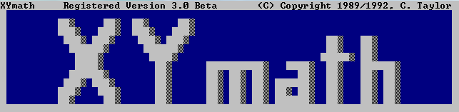
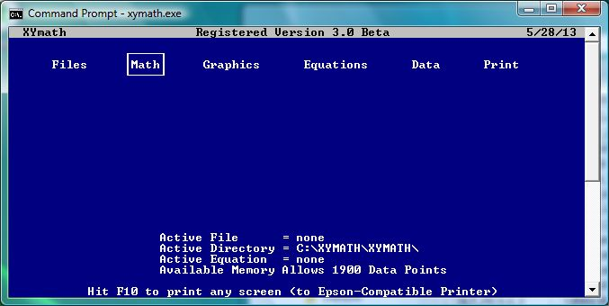
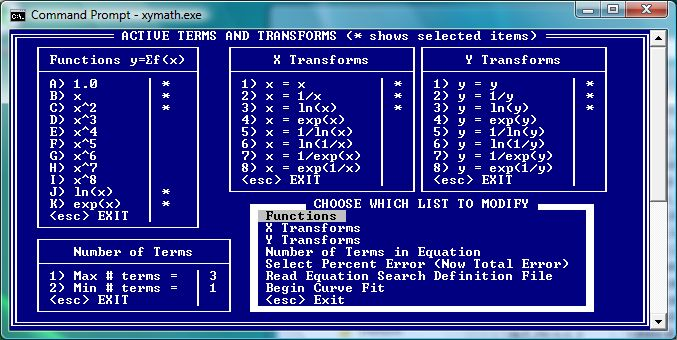

.. history

.. include:: ../HISTORY.rst
        
PyHatch
-------

XYmath Framework Created by: `PyHatch <http://pyhatch.readthedocs.org/en/latest/>`_ on Aug 30, 2015 

(PyHatch Initializes Files And Directory Structures For New Python Projects.)

See PyHatch Docs at: `<http://pyhatch.readthedocs.org/en/latest/>`_

My Youth
--------

XYmath is an update of a Turbo Pascal project from my youth. (see screen shots below)

