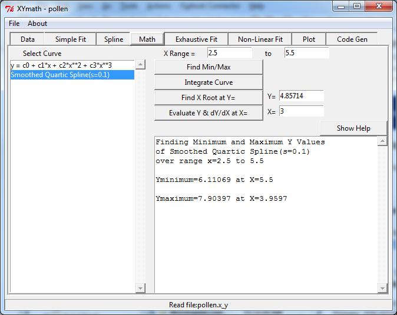
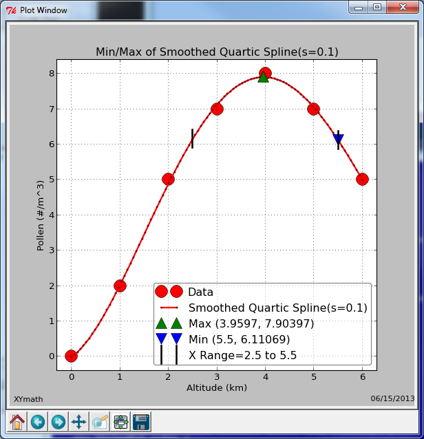
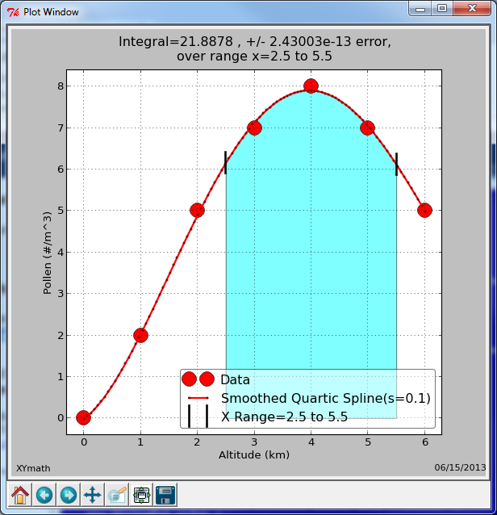
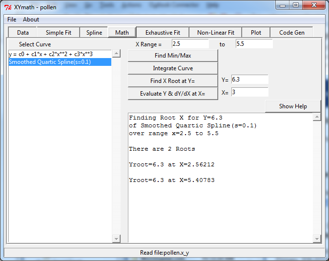
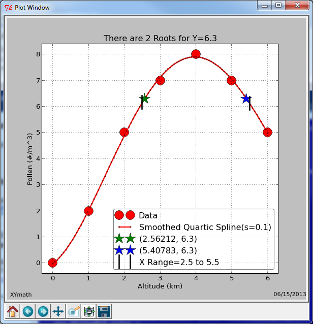
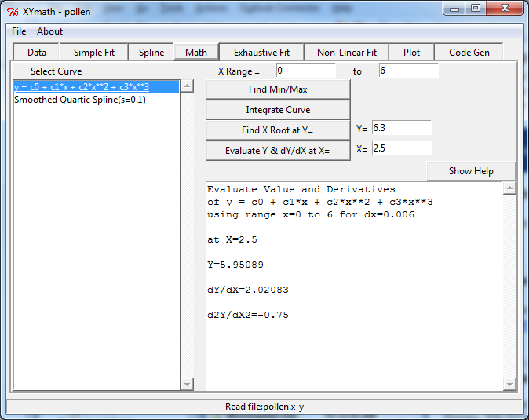
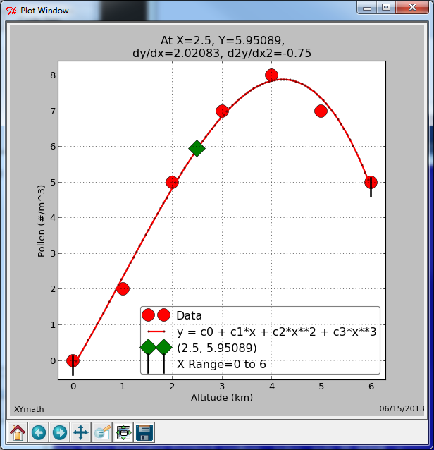

.. math_ops

.. _internal_math_ops:

Math Operations
===============

All math operations are limited to the X Range selected.

Select the equation of interest in the list box. Equations are generated in "Simple Fit", "Spline", "Exhaustive Fit" and "Non-Linear Fit".

"Find Min/Max" will find the minimum and maximum y values in the X Range.

"Integrate Curve" will perform a numerical integration over the X Range.

"Find X Root at Y" will discover what value or values of x result in the desired value of y.

"Evaluate Y & dY/dX at X" will calculate the value of y as well as 1st and 2nd derivatives at the desired value of x.

`* click images below to see them full size`

.. note::
    Use the navigation options below the plot to zoom, pan, and save plots.

Find Min/Max
------------

An example of finding the minimum and maximum is shown below. 

There are two curves in the  ``Select Curve`` list box to choose from:

    #. y = c0 + c1*x + c2*x**2 + c3*x**3
    
    #. Smoothed Quartic Spline(s=0.1)

Of those two curves, the Smoothed Quartic Spline is selected.

Notice that the ``X Range`` has been specified as 2.5 to 5.5. With that ``X Range`` as a constraint, the min and max values of Y are calculated.

The minimum value is located directly on the upper bound value of the ``X Range`` at x=5.5

The maximum value is at the peak of the Smoothed Quartic Spline at x=3.9597 and y=7.90397

The min and max (x,y) values are shown in the status box of the main interface, as well as on the plot.

    
Integrate Curve
---------------

The same ``X Range`` and the same Smoothed Quartic Spline used in the ``Find Min/Max`` example above are used here for the numerical integration example.

The area under the curve from x=2.5 to 5.5 is displayed in the status box of the main interface, as well as on the plot.

There is an error estimate for the numerical integration displayed as well.

.. warning::

    Do NOT mistake the numerical integration error for a physical integration error.
    
    The mathematical curve is indeed integrated to that accuracy, but the underlying physical data that is being modeled by the curve is typically governed by other much more significant error criteria.

    
Find X Root
-----------

Continuing the example from above, finding the value (or values) of X for which a given value of Y occurs uses:

    #. The ``Find X Root at Y=`` Button
    #. The ``Y=`` Entry Field
    
Enter the Y value of interest in the  ``Y=`` entry field and hit the ``Find X Root at Y=`` button.

In the example, there are two values of X that satisfy that requirement **(In the X Range Specified)**

Those (x,y) values are shown in the status box of the main interface, as well as on the plot.

    
Evaluae Y & dY/dX
-----------------

Continuing the example from above, finding the values of Y, dY/dX and d2Y/dX2 at a given value of X uses:

    #. The ``Evaluate Y & dY/dX at X=`` Button
    #. The ``X=`` Entry Field
    
Enter the X value of interest in the  ``X=`` entry field and hit the ``Evaluate Y & dY/dX at X=`` button.

Notice that the ``Select Curve`` has been changed to ``y = c0 + c1*x + c2*x**2 + c3*x**3`` from the previous Smoothed Quartic Spline.

The calculated values are shown in the status box of the main interface, as well as on the plot for the selected polynomial.

