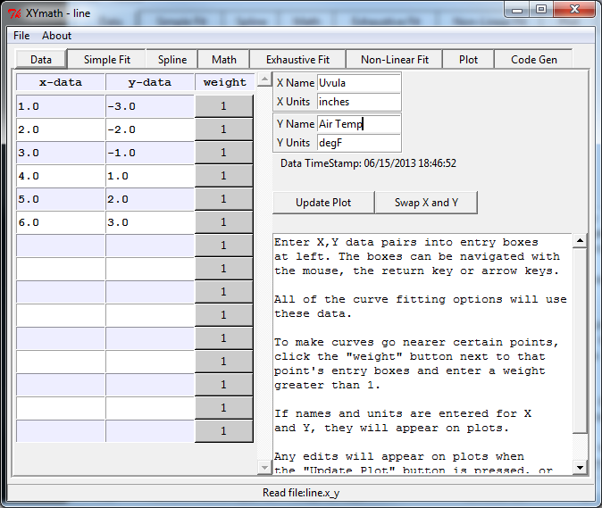

.. overview

Overview
========

XYmath will find the "best" curve fit using either minimum percent error or minimum total error. It can search through common equations, an exhaustive search through thousands of equations, splines, smoothed splines, or fit non-linear equations input by the user.

After fitting, XYmath will find roots, minima, maxima, derivatives or integrals of the curve. 

It will generate source code that documents and evaluates the fit in python, FORTRAN or EXCEL.

Configurable plots are created using matplotlib that are of publication quality.

Basic Usage
-----------

The interface consists of tabbed pages for each of the major functions. The data entry page below shows all of the tabs.

* Data - for entering X,Y data and data definitions
* Simple Fit - fits the data to common equations and ranks them
* Spline - fits the data to one of several splines
* Math - performs min/max, derivative, integration, root finding on curve fit
* Exhaustive Fit - searches hundreds or millions of equations for best fit
* Non-Linear Fit - fits data to a user-defined, non-linear equation
* Plot - provides plotting options
* Code Gen - generates python, FORTRAN or Excel code to document and implement curve fit

There is a "Show Help" button on most pages to provide guidance.

    